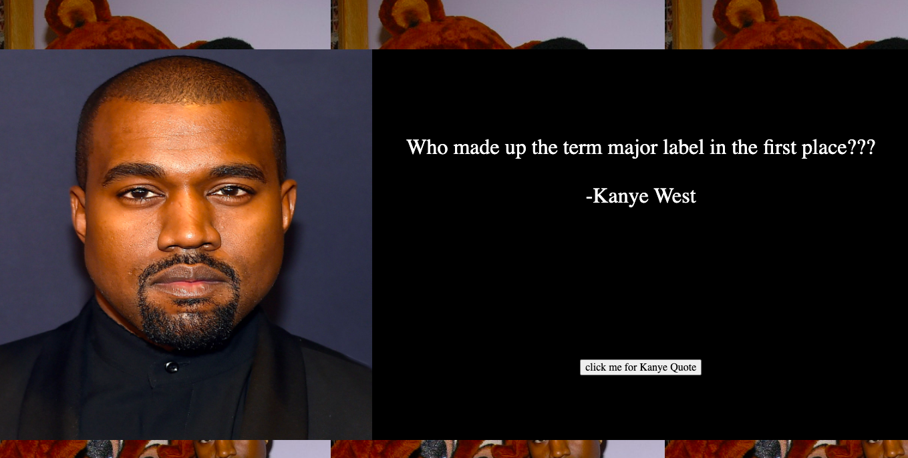

# Kanyeapi Website

This is a website I buit for a twitch streamer. It uses a Kanye West api to generate quotes from the billionaire rapper. 
**Link to project:** https://kanye-api.netlify.app/

## How It's Made:
**Tech used:** HTML, CSS, JavaScript

After requesting the data from the API in a JSON format and receiving it. I then append it the DOM using javascript. The background and main image is styled using CSS to make the website modern and responsive. 

## Lessons Learned:

I learned that even the simplest API's can be leveraged to make a beautiful and interactive site.